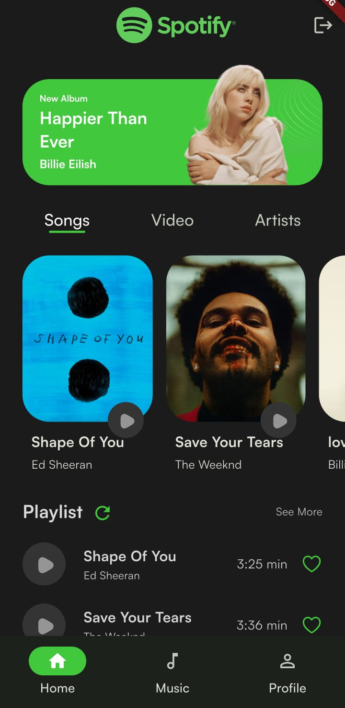
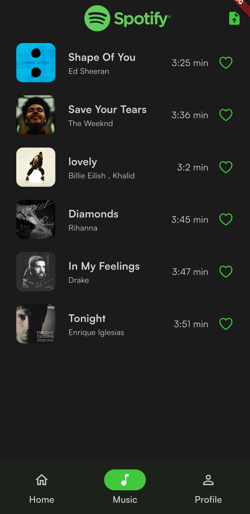

Here’s a **clean, production-style `README.md`** for your repo. You can paste it into your project as-is and tweak any TODO blocks (like screenshots and environment variables).

---

# Soundify — Flutter Spotify Clone (BLoC)

A Spotify-style music app built with **Flutter** and **BLoC** for reactive, testable state management. Clean architecture, modular code, and room to grow (offline cache, playlists, queueing, etc.). ([GitHub][1])

---

## 📸 Screenshots / Demo

| Home                               | Now Playing                                      | Library                                  | Splash                                 |
| ---------------------------------- | ------------------------------------------------ | ---------------------------------------- | -------------------------------------- |
|  |  |  |  |

---

## ✨ Features

* Spotify-like **home feed**, **search**, **library**, and **player** shells
* **BLoC** (Business Logic Components) for predictable state & separation of concerns
* **Repository pattern** for data access (ready to plug REST/Firebase/local DB)
* Extensible **audio pipeline** (queue, skip/seek, background playback)
* **Theming** & **responsive UI** for phone/tablet/web
* Built-in linting via `analysis_options.yaml` and strong types

> The repo currently includes Flutter app scaffolding with `android/`, `assets/`, `lib/`, `test/`, and project configs like `pubspec.yaml`. There’s also a `firebase.json` prepared for future integrations. ([GitHub][1])

---

## 🧱 Tech Stack

* **Flutter** (stable)
* **Dart**
* **BLoC** + `flutter_bloc`
* (Optional) **Firebase** for auth/storage/analytics (repo already includes `firebase.json`) ([GitHub][1])
* (Optional) **just_audio** / **audio_service** for playback

---

## 🧭 Architecture

**Layered + BLoC**

* **Presentation**: widgets, pages, and blocs/cubits
* **Domain**: entities, use-cases (pure Dart)
* **Data**: repositories, data sources (remote/local), mappers

**Why BLoC?**

* Clear separation between UI and logic
* Testable streams of state
* Easy to compose and reuse

---

## 📁 Project Structure

> This mirrors what’s in your repo today and proposes a conventional structure inside `lib/` so contributors know where to add things. Root files & folders confirmed: `android/`, `assets/`, `lib/`, `test/`, `.gitignore`, `.metadata`, `analysis_options.yaml`, `devtools_options.yaml`, `firebase.json`, `pubspec.yaml`. ([GitHub][1])

```
soundify/
├─ android/                      # Android project (Gradle, manifests)
├─ assets/
│  ├─ icons/                     # App icons & SVGs
│  ├─ images/                    # Bitmap assets
│  └─ audio/                     # Optional local samples for dev
├─ lib/
│  ├─ app/
│  │  ├─ app.dart                # MaterialApp + routing
│  │  └─ di/                     # Dependency injection (get_it / etc.)
│  ├─ core/
│  │  ├─ constants/              # AppConstants, route names
│  │  ├─ errors/                 # Exceptions, failure types
│  │  ├─ theme/                  # ThemeData, text styles
│  │  └─ utils/                  # Formatters, helpers
│  ├─ features/
│  │  ├─ home/
│  │  │  ├─ presentation/
│  │  │  │  ├─ pages/            # HomePage
│  │  │  │  ├─ widgets/
│  │  │  │  └─ bloc/             # HomeBloc, events, states
│  │  │  ├─ domain/
│  │  │  │  ├─ entities/         # Track, Album, Artist
│  │  │  │  └─ usecases/         # GetHomeFeed
│  │  │  └─ data/
│  │  │     ├─ models/           # DTOs (TrackModel)
│  │  │     ├─ repositories/     # HomeRepositoryImpl
│  │  │     └─ datasources/      # RemoteDataSource, LocalDataSource
│  │  ├─ player/
│  │  │  ├─ presentation/        # PlayerPage, controls
│  │  │  ├─ domain/              # Player commands (Play/Pause/Seek)
│  │  │  └─ data/                # Player adapters to audio plugin(s)
│  │  ├─ search/
│  │  └─ library/
│  ├─ router/
│  │  └─ app_router.dart         # GoRouter or onGenerateRoute
│  └─ main.dart                  # Entry point
├─ test/                         # Unit/widget tests
├─ .gitignore
├─ .metadata
├─ analysis_options.yaml         # Lints/analysis rules
├─ devtools_options.yaml
├─ firebase.json                 # Firebase hosting/config placeholder
├─ pubspec.yaml                  # Dependencies & assets
└─ README.md
```

> If your current `lib/` differs, keep the **spirit** (separation into `presentation/domain/data`) and move files into these buckets over time.

---

## 🚀 Getting Started

### Prerequisites

* Flutter SDK installed (`flutter --version`)
* Dart SDK (bundled with Flutter)
* Android Studio / Xcode (platform toolchains)
* (Optional) Firebase CLI if enabling Firebase features

### 1) Clone & Install

```bash
git clone https://github.com/ayxn07/soundify.git
cd soundify
flutter pub get
```

### 2) Configure Assets

In `pubspec.yaml`, ensure your assets are listed:

```yaml
flutter:
  uses-material-design: true
  assets:
    - assets/icons/
    - assets/images/
```

### 3) (Optional) Wire Up Firebase

* Create a Firebase project.
* Add Android/iOS/Web apps.
* Download platform configs (e.g., `google-services.json`, `GoogleService-Info.plist`) into the native folders.
* Enable desired products (Auth/Firestore/Storage/Analytics).

> The repo already contains `firebase.json` as a starting point. ([GitHub][1])

### 4) Run

```bash
# List devices
flutter devices

# Launch in debug
flutter run

# Or build
flutter build apk   # Android
flutter build ios   # iOS (on macOS)
flutter build web   # Web (optional)
```

---

## 🧪 Testing

```bash
flutter test
```

* **Widget tests**: for pages and key widgets
* **Bloc tests**: using `bloc_test` to validate event→state transitions
* **Mocktail** for repository/datasource fakes

---

## 🧩 State Management (BLoC)

* Each **feature** owns its **Bloc/Cubit** (`features/*/presentation/bloc`)
* **Events** drive **Bloc**, emitting **States** consumed by the UI
* **Repositories** abstract data access; **UseCases** coordinate operations

**Example (pseudo):**

```dart
// Event
class FetchHomeFeed extends HomeEvent {}

// State
class HomeLoading extends HomeState {}
class HomeLoaded extends HomeState {
  final List<Track> tracks;
  HomeLoaded(this.tracks);
}

// Bloc
on<FetchHomeFeed>((event, emit) async {
  emit(HomeLoading());
  final tracks = await homeRepository.getHomeFeed();
  emit(HomeLoaded(tracks));
});
```

---

## 🔗 Routing

Use your preferred router:

* **GoRouter** for declarative routes
* or classic `onGenerateRoute` in `router/app_router.dart`

---

## 📦 Notable Scripts / Commands

```bash
flutter pub run build_runner build --delete-conflicting-outputs   # if you add json_serializable/freezed
dart fix --apply                                                  # apply fix-its
flutter format .                                                  # format codebase
```

---

## 🛡️ Linting & Style

* Lints configured via `analysis_options.yaml` for consistency and best practices (null-safety, immutability where possible, avoiding dynamic, etc.)

---

## 🗺️ Roadmap

* [ ] Real playback integration (`just_audio` + `audio_service`)
* [ ] Background control & notification controls
* [ ] Auth & user library (Firebase or custom backend)
* [ ] Offline cache & downloads
* [ ] Playlists & queue management
* [ ] Theming polish & animations
* [ ] CI: GitHub Actions (build/test/format)

---

## 🤝 Contributing

1. Fork the repo
2. Create a feature branch: `git checkout -b feat/amazing`
3. Commit: `git commit -m "feat: add amazing"`
4. Push: `git push origin feat/amazing`
5. Open a PR

**Coding guidelines**

* One feature per PR
* Tests where sensible
* Keep layers clean (no UI in data layer, etc.)

---

## 📚 Appendix

* Current repo description references “A Spotify-clone built with Flutter using BLoC…” and the file list shows `android/`, `assets/`, `lib/`, `test/`, and config files (`pubspec.yaml`, `analysis_options.yaml`, `devtools_options.yaml`, `firebase.json`). Use this README as the blueprint to fill in concrete code and screenshots as you implement features. ([GitHub][1])
